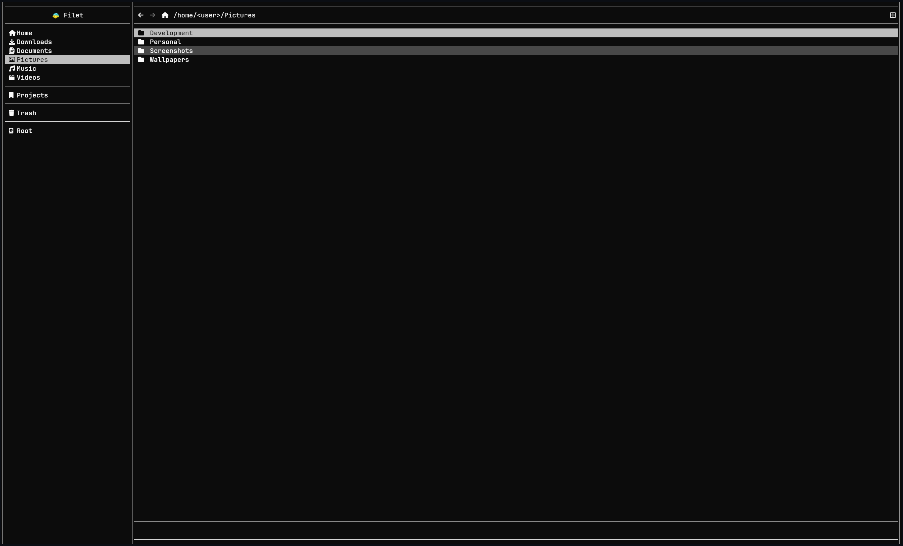
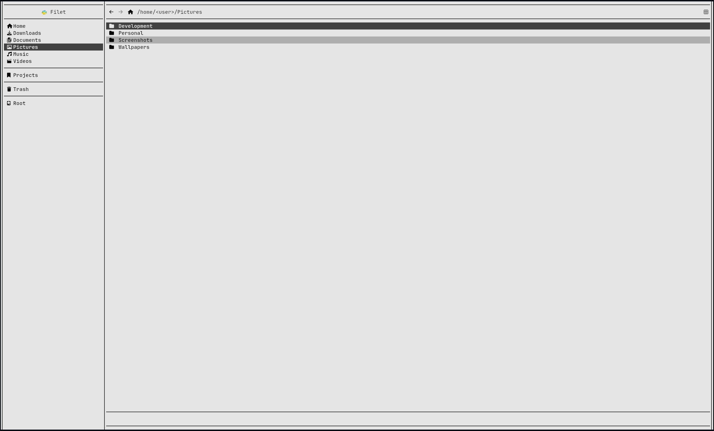
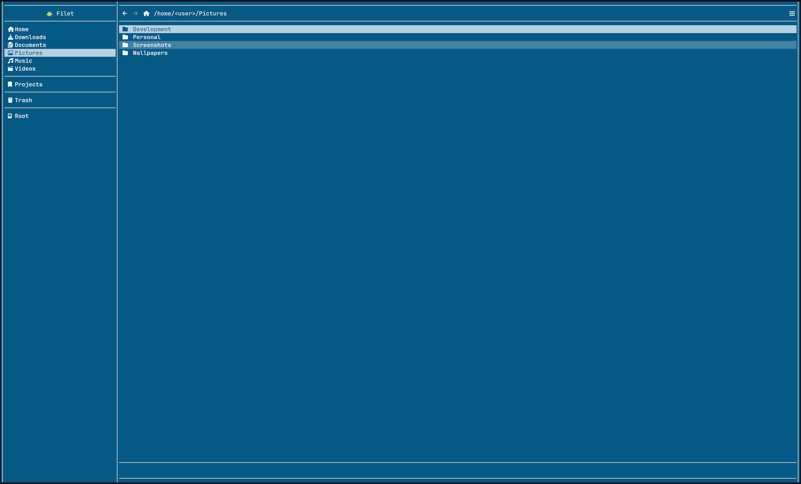
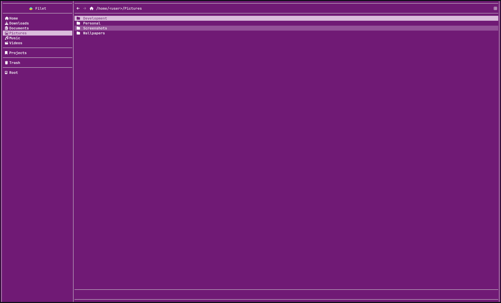

<p align="center">
  
</p>

# filet

Simple terminal file manager with first party mouse support. Built with OpenTUI on Bun.

## Disclaimers

- LLMs were used during development for research, prototyping, refactoring, and some code generation.
- This is beta software and bugs should be expected. Use at your own risk.
- A Nerd Font is required for icon support.

## Features

- Explore directories.
- Preview text based files and images.
- Copy, cut, rename, trash and delete files and directories.
- Bookmarks and a themeable UI, configurable through a user config file.
- First party mouse support.

## Screenshots

<table>
  <tr>
    <td>
        
    </td>
    <td>
        
    </td>
  </tr>
  <tr>
    <td>
        
    </td>
    <td>
        
    </td>
  </tr>
</table>

## Configuration

filet ships with a default config at `config.toml`. To override it, create your own config file at:

```
~/.config/filet/config.toml
```

Values in your user config take priority over the defaults, and any values you leave out fall back to the defaults, for example:

```toml
bookmarks = [
    {label = "Projects", mount = "/home/<user>/Projects"},
]

trash_path = "/home/<user>/.local/share/Trash"

double_click_timeout = 250

[theme]
bg = "#0C0C0C"
fg = "#fafafa"
border = "#d4d4d4"
success = "#16a34a"
danger = "#dc2626"
```

## Controls

### Mouse

| Action         | Target         | Result                                                         |
| -------------- | -------------- | -------------------------------------------------------------- |
| `Left click`   | File or folder | Select it.                                                     |
| `Double click` | File or folder | Open it. Folders in explorer and files a preview if suportted. |
| `Right click`  | File or folder | Open its context menu.                                         |
| `Right click`  | Explorer       | Open the explorer context menu.                                |
| `Left click`   | Sidebar link   | Select and navigate to it.                                     |

### Keyboard

| Key      | Action                                                         |
| -------- | -------------------------------------------------------------- |
| `Ctrl+X` | Cut the selected file or folder.                               |
| `Ctrl+C` | Copy the selected file or folder.                              |
| `Ctrl+V` | Paste the cut or copied file or folder.                        |
| `Ctrl+R` | Rename the selected file or folder.                            |
| `Ctrl+D` | Drag and drop the selected file or folder using `ripdrag`.     |
| `Return` | Clear the selected file or folder.                             |
| `Escape` | Open it. Folders in explorer and files a preview if suportted. |
| `Q`      | Quit the application.                                          |

`Ctrl+D` requires [ripdrag](https://github.com/nik012003/ripdrag) to be installed and available on your `PATH`.

## Building

filet uses Bun as its runtime, package manager, and bundler.

Install dependencies:

```
bun install
```

Build a standalone binary:

```
bun run build
```

This produces a binary at `dist/filet`.

## Installing

After building, install the binary and desktop entry with:

```
bun run install:app
```

This copies the binary to `~/.local/bin/filet` and adds a desktop entry at `~/.local/share/application/filet` for application launcher. Add `~/.local/bin` to your your `PATH` to run `filet` directly from a terminal.

### From a release

You can also skip building and download the latest release from the [Releases](../../releases) page on GitHub. Unzip the archive and run the included install script:

```
./install.sh
```

This installs filet the same way as `bun run install:app`.

## Roadmap

- [x] Use an input for the current directory path to allow manual editing.
- [ ] Add a name resolver to allow filesystem functions for files/folders with the same names.
- [ ] Simple search function for the current directory.
- [ ] Ability to open files marked as executables instead of previewing them.
- [ ] Hide the sidebar when the viewport reaches a small enough size.
- [ ] Improve the grid view option for visual clarity.
- [ ] Add default display type as a configurable value.
