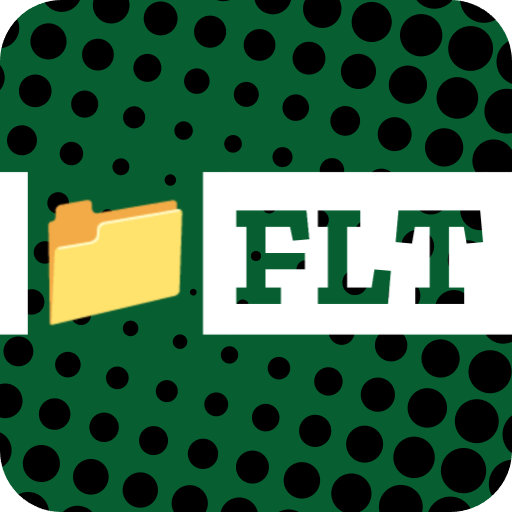

<p align="center">
  
</p>

# filet

A terminal file manager built on Bun and OpenTUI.

## Features

- Explore directories from the terminal.
- Preview text based files and images.
- Copy, cut, paste, and delete files and directories.
- Bookmarks and a themeable UI, configurable through a user config file.
- First party mouse support.

## Configuration

filet ships with a default config at `config.toml`. To override it, create your own config file at:

```
~/.config/filet/config.toml
```

Values in your user config take priority over the defaults, and any values you leave out fall back to the defaults, for example:

```toml
bookmarks = [
    {label = "Projects", mount = "/home/user/Projects"},
]

trash_path = "/home/<user>/.local/share/Trash"

double_click_timeout = 250

[theme]
bg = "#0C0C0C"
fg = "#fafafa"
success = "#16a34a"
danger = "#dc2626"
```

## Building

filet uses Bun as its runtime, package manager, and bundler.

Install dependencies:

```
bun install
```

Build a standalone binary:

```
bun run build
```

This produces a binary at `dist/filet`.

## Installing

After building, install the binary and desktop entry with:

```
bun run install:app
```

This copies the binary to `~/.local/bin/filet` and adds a desktop entry so filet can be launched like any other application. Make sure `~/.local/bin` is on your `PATH` to run `filet` directly from a terminal.
