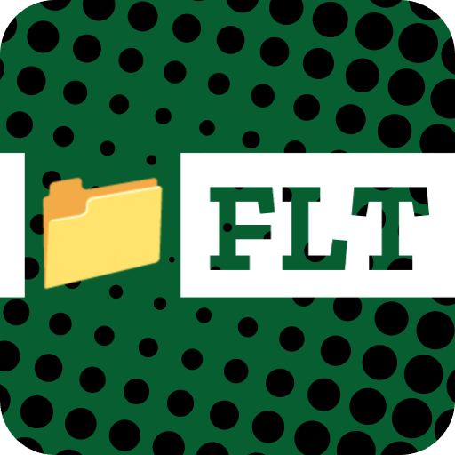
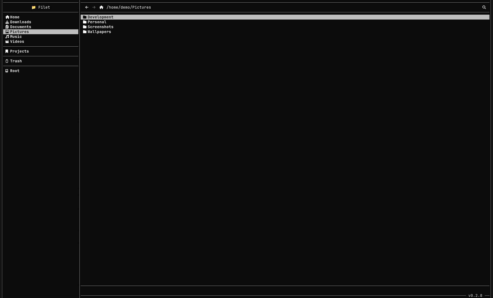
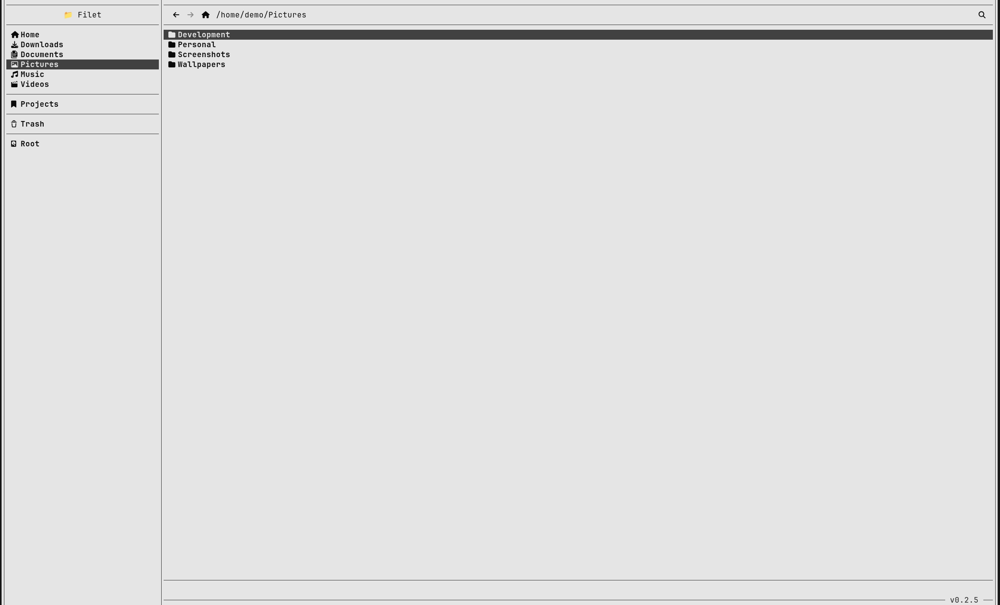
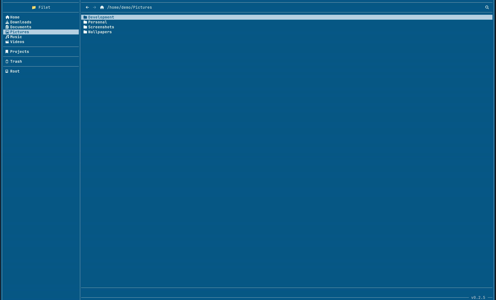
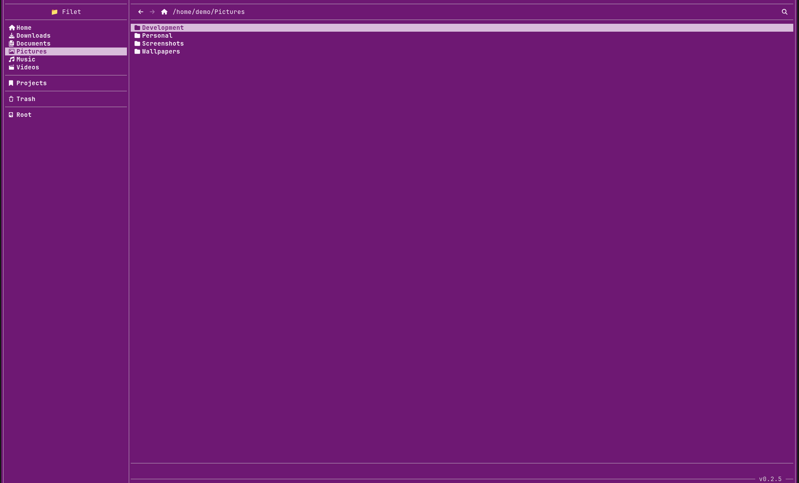

<p align="center">
  
</p>

# filet

Simple terminal file manager with first party mouse support. Built with OpenTUI on Bun.

## Disclaimers

- LLMs were used during development for research, prototyping, refactoring, and some code generation.
- This is beta software and bugs should be expected. Use at your own risk.
- A Nerd Font is required for icon support.

## Requirements

- `tar` and `unzip` for extracting archives. Supported formats are `.tar`, `.tar.gz`, `.tgz`, `.tar.xz`, `.txz`, `.tar.bz2`, `.tbz2`, `.tar.zst`, `.tzst` and `.zip`.
- `xz`, `bzip2` and `zstd` for `.tar.xz`, `.tar.bz2` and `.tar.zst` archives respectively.
- [ripdrag](https://github.com/nik012003/ripdrag) for drag and drop with `A`.

## Features

- Explore directories with back and forward navigation and an editable path bar. Entering a file path opens its folder with the file selected, relative paths such as `..` resolve against the current folder, and `~` expands to your home folder. Paths that can't be opened are reported in the footer.
- Search the current directory by name.
- Preview files in a sidebar, opened with `P` or the Preview context menu item. It stays open while you select other files, and shows text based files with syntax highlighting and line numbers, and PNG, JPEG, GIF and WebP images. Text files over 1 MB, binary files and images over 25 megapixels are not previewed.
- Show the properties of a file or folder with `I` or the Properties context menu item: type, path, size, permissions, owner, group, and modified, accessed and created dates. Symbolic links show their target, and folders, including linked folders, show their item count and total size, calculated with `du`.
- Open files in their default application, or run them if they are executable.
- Create, copy, cut, paste, rename, trash and delete files and directories.
- Restore files and directories from trash, or empty it.
- Extract `.tar`, `.tar.gz`, `.tar.xz`, `.tar.bz2`, `.tar.zst` and `.zip` archives.
- Drag and drop files and directories into other applications with `ripdrag`.
- Open a terminal in the current folder, or in a folder from its context menu.
- Copy the paths of files and directories to the system clipboard.
- Move through the explorer with the arrow keys or `H`, `J`, `K` and `L`, and act on the selection with single letter shortcuts.
- Nerd Font file icons and context menus.
- Bookmarks and a themeable UI, configurable through a user config file.
- First party mouse support.

## Screenshots

<table>
  <tr>
    <td>
        
    </td>
    <td>
        
    </td>
  </tr>
  <tr>
    <td>
        
    </td>
    <td>
        
    </td>
  </tr>
</table>

## Configuration

filet works without a config file. To change its defaults, create a config file at:

```
~/.config/filet/config.toml
```

Values in your user config take priority over the defaults, and any values you leave out fall back to the defaults. Paths can start with `~` for your home folder. For example:

```toml
bookmarks = [
    {label = "Projects", mount = "/home/<user>/Projects"},
]

trash_path = "/home/<user>/.local/share/Trash"

logs_path = "/home/<user>/.local/state/filet/logs"

double_click_timeout = 250

terminal = "kitty"

[theme]
bg = "#0C0C0C"
fg = "#fafafa"
border = "#d4d4d4"
success = "#16a34a"
danger = "#dc2626"
accent = "#0369a1"
```

`terminal` is the command run by `O` and the Open in Terminal menu items, started in the current folder, or in the folder you right clicked. It can include arguments, such as `"kitty --single-instance"`, which are split on spaces. When an argument or the path to the terminal contains spaces, use a list instead, such as `["kitty", "--title", "My Terminal"]`. Without it, or when it's invalid, filet uses `$TERMINAL`, then [`xdg-terminal-exec`](https://gitlab.freedesktop.org/terminal-wg/specifications). If the folder can't be opened, or the terminal can't be started or quits with an error within 2 seconds, the footer says so and the error is logged.

## Logs

Errors are saved to a file per day at `~/.local/state/filet/logs/YYYY-MM-DD.jsonl`, or in the folder set by `logs_path`. Each line is a JSON object with a local `timestamp`, the error `message`, and the `code`, `errno`, `syscall` and `path` where available, for example:

```json
{"timestamp":"2026-09-29T14:03:12.345+02:00","code":"EEXIST","syscall":"mkdir","path":"/home/<user>/archive","message":"EEXIST: file already exists, mkdir '/home/<user>/archive'"}
```

To read a day's logs with [jq](https://jqlang.org):

```
jq . ~/.local/state/filet/logs/2026-09-29.jsonl
```

## Controls

### Mouse

| Action         | Target         | Result                                                                                                      |
| -------------- | -------------- | ----------------------------------------------------------------------------------------------------------- |
| `Left click`   | File or folder | Select it. Files are shown in the preview sidebar while it is open.                                         |
| `Double click` | File or folder | Open it. Folders open in the explorer, and files in their default application, or run if executable.        |
| `Ctrl+click`   | File or folder | Mark or unmark it, and select it.                                                                           |
| `Right click`  | File or folder | Open its context menu.                                                                                      |
| `Right click`  | Explorer       | Open the explorer context menu.                                                                             |
| `Left click`   | Sidebar link   | Select and navigate to it.                                                                                  |

### Keyboard

| Key           | Action                                                                                           |
| ------------- | ------------------------------------------------------------------------------------------------ |
| `Return`      | Open the selected file or folder, the same as a double click.                                    |
| `Space`       | Mark or unmark the selected file or folder, then select the entry below.                         |
| `Escape`      | Clear the marks, or the selection when nothing is marked.                                        |
| `Up` / `K`    | Select the entry above, scrolling it into view. With nothing selected, select the last entry.    |
| `Down` / `J`  | Select the entry below, scrolling it into view. With nothing selected, select the first entry.   |
| `Left` / `H`  | Go up to the parent folder, selecting the folder you came from. Stops at the top of the trash.   |
| `Right` / `L` | Open the selected folder. Does nothing in the trash.                                             |
| `P`           | Open or close the preview sidebar.                                                               |
| `I`           | Show the properties of the selected file or folder.                                              |
| `Ctrl+X`      | Cut the marked items, or the selected file or folder.                                            |
| `Ctrl+C`      | Copy the marked items, or the selected file or folder.                                           |
| `Ctrl+V`      | Paste the cut or copied items into the current folder.                                           |
| `Y`           | Copy the paths of the marked items, or the selected file or folder, to the system clipboard.     |
| `Ctrl+R`      | Refresh the current folder, keeping the selection.                                               |
| `R`           | Rename the selected file or folder.                                                              |
| `N`           | Create a new file in the current folder.                                                         |
| `F`           | Create a new folder in the current folder.                                                       |
| `T`           | Move the marked items, or the selected file or folder, to trash, after confirmation.             |
| `Ctrl+Z`      | Restore a file or folder from trash, after confirmation.                                         |
| `D`           | Permanently delete the marked items, or the selected file or folder, after confirmation.         |
| `E`           | Extract the selected archive into a folder next to it. See [Requirements](#requirements).        |
| `O`           | Open a terminal in the current folder. See [Configuration](#configuration).                      |
| `A`           | Drag and drop the marked items or selection with `ripdrag`. See [Requirements](#requirements).   |
| `Q`           | Quit the application, after confirmation.                                                        |

In the path bar, `Escape` stops editing and shows the current folder again. Prompt modals focus their input when they open. In confirmation and prompt modals, `Return` confirms and `Escape` cancels. The properties modal closes with `Return` or `Escape`.

## Theming

Besides the default dark theme, here are a few others to try. Copy one into your `~/.config/filet/config.toml`, replacing the existing `[theme]` section. Or create your own theme.

Tip: See the [tailwind](https://tailwindcss.com/docs/colors) color pallet.

Colours are hex values, such as `#fafafa`, `#fff` or `#fafafaff`. An invalid colour falls back to its default. Invalid colours, unknown keys, and a `[theme]` or `[theme.syntax]` that isn't a table are written to the error log.

Besides `bg`, `fg`, `border`, `success` and `danger`, a theme can set:

- `accent`: the highlight for marked entries. Defaults to `#0369a1`.
- `surface`: the background of menus, prompts and confirmations. Defaults to `bg`, made fully opaque.

Set `bg = "transparent"` to use your terminal's own background. `surface` then defaults to black when `fg` is light and white when it is dark, so set it to match your terminal. A partly transparent `bg`, such as `#0c0c0c80`, keeps menus and modals opaque in its own colour.

Code previews use a light syntax highlighting palette when `bg` is a light color, and a dark one otherwise. With `bg = "transparent"`, the palette follows `fg` instead: dark when `fg` is light, and light when it is dark. Any of its colours can be overridden:

```toml
[theme.syntax]
keyword = "#ff7b72"
string = "#a5d6ff"
comment = "#8b949e"
number = "#79c0ff"
function = "#d2a8ff"
type = "#ffa657"
```

### Ivory

```toml
[theme]
bg = "#e5e5e5"
fg = "#0a0a0a"
border = "#262626"
success = "#16a34a"
danger = "#dc2626"
accent = "#0369a1"
```

### Sky

```toml
[theme]
bg = "#075985"
fg = "#f0f9ff"
border = "#d4d4d4"
success = "#16a34a"
danger = "#dc2626"
accent = "#ec4899"
```

### Fuchsia

```toml
[theme]
bg = "#701a75"
fg = "#fdf4ff"
border = "#d4d4d4"
success = "#16a34a"
danger = "#dc2626"
accent = "#0369a1"
```

## Building

filet uses Bun as its runtime, package manager, and bundler.

Install dependencies:

```
bun install
```

Build a standalone binary:

```
bun run build
```

This produces a binary at `dist/filet`.

## Installing

After building, install the binary and desktop entry with:

```
bun run install:app
```

This copies the binary to `~/.local/bin/filet` and adds a desktop entry at `~/.local/share/applications/filet` for application launchers. Add `~/.local/bin` to your your `PATH` to run `filet` directly from a terminal.

### From a release

You can also skip building and download the latest release from the [Releases](../../releases) page on GitHub.

Extract the archive.
```
tar -xvJf "Release 0.2.9.tar.xz" --one-top-level
```
cd Into the extracted directory.
```
cd "Release 0.2.9"
```
Run the install script.
```
./install.sh
```

This installs filet the same way as `bun run install:app`.

## Roadmap

- [x] Allow manually editing the current path.
- [x] Simple search function for the current directory.
- [x] Ability to open files marked as executables instead of previewing them.
- [x] Hide the sidebar when the viewport reaches a small enough size.
- [x] Option to restore a file from trash.
- [x] Add option to extract archives.
- [x] Improve overall theming support.
- [x] Virtualize the explorer list so directories with more than ~16,000 entries (e.g. `/nix/store`) load fully.
- [ ] Add option to compress files/folders.
- [ ] Add a name resolver to allow filesystem functions for files/folders with the same names.
